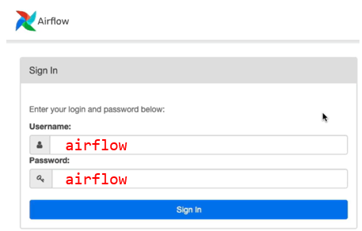

# Codespaces Airflow training environment

This repository contains the code for the Airflow training environment.

## Getting started

1. Check that you have enough memory allocated to your codespaces instance. In the terminal (ctrl + ` ) check you have more than 4GB of allocated memory:

    ```
    docker run --rm "debian:bullseye-slim" bash -c 'numfmt --to iec $(echo $(($(getconf _PHYS_PAGES) * $(getconf PAGE_SIZE))))'
    ```

    An no, 3.9 is not enough. If you see 3.9 means that you did not selected the right machine in step 2.

1. Run database migrations *(ONLY RUN ONCE)*

    You need to run database migrations and create the first user account. It is all defined in the docker compose file so just run:
    ```
    docker compose up airflow-init
    ```

1. Now you can start all services:
    ```
    docker compose up
    ```

    This will make Airflow available at: http://localhost:8080


1. Login to Airflow:

    


# Running Airflow in a Python Environment
If for some reason its not possible to you to run Airflow using docker, you can also do it using python.

1. Install airflow
    ```
    pip install apache-airflow
    ```
    or
    ```
    poetry add apache-airflow
    ```

    Make sure you have a virtual environment activated in which you can isolate your code/dependencies


1. initialize the database
    ```
    airflow db init
    ```

1. Create a new user
    ```
    airflow users create --username airflow --password airflow --firstname anon --lastname nymus --role Admin --email user@company.com 
    ```

1. Copy your dags to the dags/ folder
    ```
    cp dags/mydag.py ~/airflow/dags/
    ```

1. In a termnial initialize the webserver
    ```
    airflow webserver -p 8080
    ```

1. In a second terminal initialize the scheduler
    ```
    airflow scheduler
    ```
